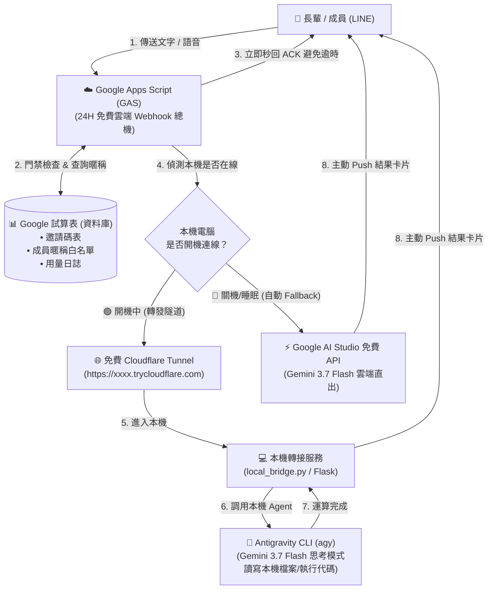
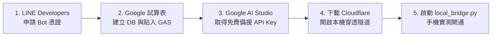

# 🚀 零成本極簡 AI Agent 系統架構規劃書 (GAS + 本機 CLI 終極實戰版)
*(Google Apps Script 雲端總機 + Google 試算表手機資料庫 + 本機 Antigravity CLI 算力 + Cloudflare Tunnel + 智慧離線雙軌容錯)*

---

## 📋 一、系統總覽與三大核心優勢

本架構專為**零雲端主機預算、追求極致簡潔、以及希望最大化利用本機已登入 Antigravity 算力**的開發者量身打造：

> **「雲端 0 元託管 (GAS) 負責門禁與秒回，手機 Google 試算表負責暱稱管理，本機 Antigravity CLI (Gemini 3.7 Flash) 負責重型運算，電腦關機自動無縫 Fallback 雲端免費 API。」**

### 🌟 四大核心優勢

```text
┌─────────────────────────────────────────────────────────────┐
│ 1. 0 元伺服器租用費  : Google 免費託管 GAS，免租 VPS / 免架 Docker  │
├─────────────────────────────────────────────────────────────┤
│ 2. 手機可視化管理庫  : Google 試算表直接當 DB，手機 App 一鍵發邀請碼 │
├─────────────────────────────────────────────────────────────┤
│ 3. 白嫖本機最強算力  : 複用 Antigravity 登入狀態 (Gemini 3.7 百萬 Token)│
├─────────────────────────────────────────────────────────────┤
│ 4. 群組防洗版標記響應: 群組強制 @提及 (Mention) 觸發，省 Token 不擾民 │
└─────────────────────────────────────────────────────────────┘
```

---

## 🏗️ 二、系統總體架構藍圖 (End-to-End Blueprint)



---

## 📊 三、Google 試算表資料庫結構與使用身分 (Role) 設計

建立一個名為 `AI_Agent_Database` 的 Google 試算表，包含以下三張工作表 (Sheets)：

### 👑 使用身分權限矩陣 (User Roles)
* 🔴 **`admin` (系統管理員)**：**最高權限**。可直接在 LINE 對話框輸入 `/admin` 指令（或自然語言）查詢、新增、修改與刪除 Google 試算表內容（如發行邀請碼、修改成員身分與額度、停用帳號）。
* 👵 **`elderly` (長輩親切語音)**：自動套用親切溫和、字體分點說明與長輩模式，支援語音與文字發問。
* 💻 **`developer` (開發者沙盒)**：調用本機 Antigravity 進行程式碼執行、本機檔案分析與深度推理。
* 👤 **`member` (一般成員)**：一般日常 AI 問答助手。

---

### 1. 【工作表 1：`Invitations` 專屬邀請碼表】
| 欄位 A (邀請碼) | 欄位 B (目標成員暱稱) | 欄位 C (角色權限) | 欄位 D (每日額度) | 欄位 E (狀態) | 欄位 F (建立時間) |
| :--- | :--- | :--- | :--- | :--- | :--- |
| `ADMIN-0001` | 管理員 (Kent) | `admin` (系統管理員) | 999999 | `BOUND` (已綁定) | 2026-08-27 09:00 |
| `KENT-8899` | 奶奶 (台中) | `elderly` (長輩親切語音) | 50000 | `BOUND` (已綁定) | 2026-08-27 10:00 |
| `KENT-7721` | 工程師 小陳 | `developer` (代碼沙盒) | 200000 | `UNUSED` (未使用) | 2026-08-27 11:30 |

### 2. 【工作表 2：`Users` 授權成員白名單表】
| 欄位 A (LINE User ID) | 欄位 B (成員暱稱) | 欄位 C (角色) | 欄位 D (每日額度) | 欄位 E (狀態) | 欄位 F (綁定時間) |
| :--- | :--- | :--- | :--- | :--- | :--- |
| `U_ADMIN_123456...` | 管理員 (Kent) | `admin` | 999999 | `ACTIVE` | 2026-08-27 09:05 |
| `U1234567890abcdef...` | 奶奶 (台中) | `elderly` | 50000 | `ACTIVE` | 2026-08-27 10:05 |

### 3. 【工作表 3：`Logs` 任務與用量日誌表】
| 欄位 A (時間戳記) | 欄位 B (成員暱稱) | 欄位 C (提問摘要) | 欄位 D (執行端) | 欄位 E (消耗 Token) |
| :--- | :--- | :--- | :--- | :--- |
| 2026-08-27 10:10:22 | 奶奶 (台中) | 詢問今天出門天氣 | 💻 本機 CLI | 1,250 |
| 2026-08-27 14:20:15 | 奶奶 (台中) | 煮雞湯要加什麼材料 | ☁️ 雲端 Fallback | 850 |

---

## 🎮 四、管理員專屬 LINE 遠端試算表控制指令 (Admin Command Hub)

當身分為 **`admin`** 的使用者在 LINE Bot 發送指令時，系統會攔截並直接對 Google 試算表執行讀寫操作：

| 管理指令 | 範例 | 功能說明 (直接寫入/讀取 Google 試算表) |
| :--- | :--- | :--- |
| **`/admin help`** | `/admin help` | 查詢所有管理員可用指令清單 |
| **`/admin list`** | `/admin list` | 列出目前所有已綁定的成員清單、身分、額度與狀態 |
| **`/admin invs`** | `/admin invs` | 列出目前所有「未使用 (UNUSED)」的有效邀請碼 |
| **`/admin inv <暱稱> <身分> <額度>`** | `/admin inv 媽媽 elderly 50000`<br>`/admin inv 小李 developer 200000` | **一鍵生成邀請碼**：寫入 `Invitations` 表並自動回傳邀請碼供轉發 |
| **`/admin role <暱稱> <新身分>`** | `/admin role 小陳 admin` | **修改成員身分**：將指定成員改為 `admin`、`elderly` 或 `developer` |
| **`/admin quota <暱稱> <新額度>`** | `/admin quota 奶奶 (台中) 100000` | **調整每日額度**：即時修改成員每日 Token 限額 |
| **`/admin ban <暱稱>`** | `/admin ban 壞人` | **一鍵停用**：將指定成員狀態改為 `DISABLED`，即刻封鎖 |
| **`/admin unban <暱稱>`** | `/admin unban 壞人` | **解除停用**：將成員狀態恢復為 `ACTIVE` |
| **`/admin logs`** | `/admin logs` | 查詢最近 5 筆使用紀錄與 Token 消耗狀況 |

> [!TIP]
> 非 `admin` 身分的使用者發送 `/admin` 指令時，系統將直接拒絕並提示權限不足，確保試算表資料安全無虞。

---

## 📝 五、Google Apps Script (GAS) 完整程式碼 (`Code.gs`)

在 Google 試算表擴充功能的 Apps Script 編輯器中貼入以下代碼：

```javascript
// ── 專案設定變數 ──
const LINE_ACCESS_TOKEN = PropertiesService.getScriptProperties().getProperty("LINE_ACCESS_TOKEN");
const LOCAL_TUNNEL_URL = PropertiesService.getScriptProperties().getProperty("LOCAL_TUNNEL_URL"); // 例如: https://xxx.trycloudflare.com
const GEMINI_API_KEY = PropertiesService.getScriptProperties().getProperty("GEMINI_API_KEY"); // 備用 Fallback API Key

const SPREADSHEET_ID = SpreadsheetApp.getActiveSpreadsheet().getId();

function doPost(e) {
  try {
    const json = JSON.parse(e.postData.contents);
    const events = json.events;
    
    for (let i = 0; i < events.length; i++) {
      const event = events[i];
      if (event.type === "message" && event.message.type === "text") {
        handleTextMessage(event);
      }
    }
    return ContentService.createTextOutput("OK").setMimeType(ContentService.MimeType.TEXT);
  } catch (err) {
    return ContentService.createTextOutput("Error: " + err).setMimeType(ContentService.MimeType.TEXT);
  }
}

function handleTextMessage(event) {
  const userId = event.source.userId;
  const userText = event.message.text.trim();
  const replyToken = event.replyToken;
  
  const ss = SpreadsheetApp.openById(SPREADSHEET_ID);
  
  // ── 0. 標記 (@Mention) 檢查與防洗版過濾 ──
  const isMentioned = checkBotMentioned(event, userText);
  if (!isMentioned) {
    // 若在群組/聊天室中且未標記 Bot，直接靜默忽略，不耗費 Token
    return;
  }

  // 清理掉訊息中的 @標記 字眼，保留乾淨的 Prompt
  const cleanText = cleanPromptText(event, userText);
  
  // ── 1. 處理邀請碼綁定指令 (例如: /bind KENT-8899) ──
  if (cleanText.startsWith("/bind ") || cleanText.startsWith("bind ")) {
    const code = cleanText.replace("/bind ", "").replace("bind ", "").trim().toUpperCase();
    const resultMsg = processBinding(ss, userId, code);
    replyLineMessage(replyToken, resultMsg);
    return;
  }
  
  // ── 2. 門禁檢查：查驗此 LINE ID 是否在白名單 ──
  const user = getActiveUser(ss, userId);
  if (!user) {
    replyLineMessage(replyToken, "🔒 您好！本系統僅限授權成員使用。\n\n請在此輸入管理員發放給您的【專屬邀請碼】進行開通（例如輸入：/bind KENT-8899）。");
    return;
  }

  // ── 3. 管理員專屬指令攔截與試算表控制 ──
  if (cleanText.startsWith("/admin")) {
    if (user.role !== "admin") {
      replyLineMessage(replyToken, "⚠️ 權限不足：此功能僅限【admin 系統管理員】使用！");
      return;
    }
    const adminReply = handleAdminCommand(ss, cleanText);
    replyLineMessage(replyToken, adminReply);
    return;
  }
  
  // ── 4. 一般授權成員驗證通過 ➔ 立即秒回 ACK 避免 LINE 逾時 ──
  replyLineMessage(replyToken, `🤖【${user.nickname}】的需求已受理，正在調度 AI 運算中...`);
  
  // ── 5. 轉發任務至本機 CLI 或觸發 Fallback ──
  forwardTask(userId, user.nickname, user.role, cleanText);
}

// ──────────────────────────────────────────
// 🎯 標記 (@Mention) 偵測與文字清理輔助函式
// ──────────────────────────────────────────
function checkBotMentioned(event, text) {
  const sourceType = event.source.type; // "user", "group", "room"
  
  // 1. 若為 1對1 私聊：預設隨時回應（亦可在此設為 true/強制標記）
  if (sourceType === "user") {
    return true;
  }
  
  // 2. 若為群組 (group) 或多人聊天室 (room)：必須被 @提及 才會回應
  // 檢查 LINE 官方提供的 mention 物件
  if (event.message && event.message.mention && event.message.mention.mentionees) {
    const mentionees = event.message.mention.mentionees;
    for (let i = 0; i < mentionees.length; i++) {
      // isSelf: true 代表使用者在 LINE 官方介面中 @ 了本 Bot
      if (mentionees[i].isSelf === true) {
        return true;
      }
    }
  }
  
  // 3. 備用語音/文字前綴檢查 (例如開頭包含 @家庭AI、@Bot、@AI)
  if (text.startsWith("@") || text.includes("@Bot") || text.includes("@AI") || text.includes("@秘書")) {
    return true;
  }
  
  return false;
}

function cleanPromptText(event, text) {
  // 若包含文字 @標記，自動去除以獲得純粹問題
  let cleaned = text;
  
  // 若有原生 mention，依長度去除
  if (event.message && event.message.mention && event.message.mention.mentionees) {
    const mentionees = event.message.mention.mentionees;
    for (let i = 0; i < mentionees.length; i++) {
      if (mentionees[i].isSelf === true) {
        // 去除最前端或訊息中的 @提及
        cleaned = cleaned.replace(/@[^\s\u200B]+/g, "").trim();
      }
    }
  }
  
  // 去除通用 @ 前綴
  cleaned = cleaned.replace(/^@[\w\u4e00-\u9fa5\s]+\s*/, "").trim();
  return cleaned || text;
}

// ──────────────────────────────────────────
// 👑 管理員指令處理器 (直接讀寫 Google 試算表)
// ──────────────────────────────────────────
function handleAdminCommand(ss, cmdText) {
  const parts = cmdText.trim().split(/\s+/);
  const action = (parts[1] || "help").toLowerCase();

  const invSheet = ss.getSheetByName("Invitations");
  const userSheet = ss.getSheetByName("Users");
  const logSheet = ss.getSheetByName("Logs");

  // 1. 說明手冊
  if (action === "help") {
    return (
      "👑【管理員控制台指令清單】\n\n" +
      "1. 建立邀請碼：\n" +
      "   /admin inv <暱稱> <身分> <額度>\n" +
      "   (身分可填: elderly / developer / member / admin)\n" +
      "   例: /admin inv 媽媽 elderly 50000\n\n" +
      "2. 查詢成員清單：\n" +
      "   /admin list\n\n" +
      "3. 查詢未用邀請碼：\n" +
      "   /admin invs\n\n" +
      "4. 修改成員身分：\n" +
      "   /admin role <暱稱> <新身分>\n\n" +
      "5. 調整成員額度：\n" +
      "   /admin quota <暱稱> <新額度>\n\n" +
      "6. 停用/啟用成員：\n" +
      "   /admin ban <暱稱>\n" +
      "   /admin unban <暱稱>\n\n" +
      "7. 查閱最近日誌：\n" +
      "   /admin logs"
    );
  }

  // 2. 建立新邀請碼：/admin inv <暱稱> <身分> <額度>
  if (action === "inv" || action === "add_inv") {
    const nickname = parts[2];
    const role = parts[3] || "elderly";
    const quota = parseInt(parts[4]) || 50000;

    if (!nickname) return "❌ 格式錯誤！範例：/admin inv 媽媽 elderly 50000";

    // 自動產生 8 碼隨機邀請碼
    const randomCode = "KENT-" + Math.floor(1000 + Math.random() * 9000);
    const now = new Date();
    invSheet.appendRow([randomCode, nickname, role, quota, "UNUSED", now]);

    return (
      `🎉【邀請碼建立成功】\n\n` +
      `🎟️ 邀請碼：${randomCode}\n` +
      `👤 目標暱稱：${nickname}\n` +
      `🛡️ 角色身分：${role}\n` +
      `📊 每日額度：${quota.toLocaleString()} Tokens\n\n` +
      `💡 請將此邀請碼提供給成員，請他在 LINE 中輸入：/bind ${randomCode}`
    );
  }

  // 3. 列出所有使用者：/admin list
  if (action === "list" || action === "users") {
    const data = userSheet.getDataRange().getValues();
    if (data.length <= 1) return "📋 目前尚無已開通的成員。";

    let msg = `📋【目前授權成員名單】(共 ${data.length - 1} 人)\n`;
    for (let i = 1; i < data.length; i++) {
      const statusIcon = data[i][4] === "ACTIVE" ? "🟢" : "🔴";
      msg += `\n${statusIcon} ${data[i][1]} (${data[i][2]})\n   額度: ${Number(data[i][3]).toLocaleString()} | 狀態: ${data[i][4]}`;
    }
    return msg;
  }

  // 4. 列出未使用的邀請碼：/admin invs
  if (action === "invs") {
    const data = invSheet.getDataRange().getValues();
    let unused = [];
    for (let i = 1; i < data.length; i++) {
      if (data[i][4] === "UNUSED") {
        unused.push(`🎟️ ${data[i][0]} ➔ ${data[i][1]} (${data[i][2]}, ${Number(data[i][3]).toLocaleString()})`);
      }
    }
    if (unused.length === 0) return "ℹ️ 目前沒有待使用的邀請碼。可使用 /admin inv 新增！";
    return `🎟️【待使用邀請碼清單】\n\n` + unused.join("\n");
  }

  // 5. 修改身分：/admin role <暱稱> <新身分>
  if (action === "role") {
    const targetNickname = parts[2];
    const newRole = parts[3];
    if (!targetNickname || !newRole) return "❌ 格式錯誤！範例：/admin role 小陳 admin";

    const data = userSheet.getDataRange().getValues();
    for (let i = 1; i < data.length; i++) {
      if (data[i][1] === targetNickname) {
        userSheet.getRange(i + 1, 3).setValue(newRole);
        return `✅ 已成功將【${targetNickname}】的身分修改為：${newRole}`;
      }
    }
    return `❌ 找不到暱稱為【${targetNickname}】的成員！`;
  }

  // 6. 調整額度：/admin quota <暱稱> <新額度>
  if (action === "quota") {
    const targetNickname = parts[2];
    const newQuota = parseInt(parts[3]);
    if (!targetNickname || isNaN(newQuota)) return "❌ 格式錯誤！範例：/admin quota 奶奶 80000";

    const data = userSheet.getDataRange().getValues();
    for (let i = 1; i < data.length; i++) {
      if (data[i][1] === targetNickname) {
        userSheet.getRange(i + 1, 4).setValue(newQuota);
        return `✅ 已成功將【${targetNickname}】的每日額度調整為：${newQuota.toLocaleString()} Tokens`;
      }
    }
    return `❌ 找不到暱稱為【${targetNickname}】的成員！`;
  }

  // 7. 停用成員：/admin ban <暱稱>
  if (action === "ban") {
    const targetNickname = parts[2];
    if (!targetNickname) return "❌ 格式錯誤！範例：/admin ban 壞人";

    const data = userSheet.getDataRange().getValues();
    for (let i = 1; i < data.length; i++) {
      if (data[i][1] === targetNickname) {
        userSheet.getRange(i + 1, 5).setValue("DISABLED");
        return `🔴 已停用【${targetNickname}】的存取權限！`;
      }
    }
    return `❌ 找不到暱稱為【${targetNickname}】的成員！`;
  }

  // 8. 啟用成員：/admin unban <暱稱>
  if (action === "unban") {
    const targetNickname = parts[2];
    if (!targetNickname) return "❌ 格式錯誤！範例：/admin unban 壞人";

    const data = userSheet.getDataRange().getValues();
    for (let i = 1; i < data.length; i++) {
      if (data[i][1] === targetNickname) {
        userSheet.getRange(i + 1, 5).setValue("ACTIVE");
        return `🟢 已恢復【${targetNickname}】的正常使用權限！`;
      }
    }
    return `❌ 找不到暱稱為【${targetNickname}】的成員！`;
  }

  // 9. 查閱日誌：/admin logs
  if (action === "logs" || action === "log") {
    const data = logSheet.getDataRange().getValues();
    if (data.length <= 1) return "📋 目前尚無任何調用日誌。";

    let msg = "📊【最近 5 筆任務調用日誌】\n";
    const start = Math.max(1, data.length - 5);
    for (let i = data.length - 1; i >= start; i--) {
      const timeStr = Utilities.formatDate(new Date(data[i][0]), "GMT+8", "MM/dd HH:mm");
      msg += `\n🕒 ${timeStr} ｜ 👤 ${data[i][1]}\n   摘要: ${data[i][2]}\n   端點: ${data[i][3]} ｜ Token: ${data[i][4]}`;
    }
    return msg;
  }

  return "❓ 未知指令，請輸入 /admin help 查看指令手冊。";
}

// ──────────────────────────────────────────
// 任務調度與 Fallback 核心
// ──────────────────────────────────────────
function forwardTask(userId, nickname, role, prompt) {
  // 嘗試呼叫本機 Tunnel
  let isLocalSuccess = false;
  try {
    if (LOCAL_TUNNEL_URL) {
      const payload = {
        userId: userId,
        nickname: nickname,
        role: role,
        prompt: prompt
      };
      const options = {
        method: "post",
        contentType: "application/json",
        payload: JSON.stringify(payload),
        muteHttpExceptions: true
      };
      const response = UrlFetchApp.fetch(LOCAL_TUNNEL_URL + "/run", options);
      if (response.getResponseCode() === 200) {
        isLocalSuccess = true;
      }
    }
  } catch (e) {
    isLocalSuccess = false;
  }
  
  // 若本機電腦關機/離線 ➔ 自動切換雲端 Gemini 3.7 Flash 免費 API Fallback
  if (!isLocalSuccess) {
    runCloudFallback(userId, nickname, prompt);
  }
}

// 雲端 Fallback 直出
function runCloudFallback(userId, nickname, prompt) {
  const url = "https://generativelanguage.googleapis.com/v1beta/models/gemini-2.0-flash:generateContent?key=" + GEMINI_API_KEY;
  const payload = {
    contents: [{ parts: [{ text: `你是一位親切的家庭 AI 助手。發問者是【${nickname}】。請以溫和、分點清晰的繁體中文回答：\n\n${prompt}` }] }]
  };
  const options = {
    method: "post",
    contentType: "application/json",
    payload: JSON.stringify(payload),
    muteHttpExceptions: true
  };
  const res = UrlFetchApp.fetch(url, options);
  const data = JSON.parse(res.getContentText());
  const reply = data.candidates[0].content.parts[0].text;
  
  // 透過 LINE Push 主動推送結果
  pushLineMessage(userId, `✅【${nickname}】您的回答如下 (雲端備援模式)：\n\n${reply}`);
  logTask(nickname, prompt, "☁️ 雲端 Fallback", 800);
}

// 邀請碼綁定邏輯
function processBinding(ss, userId, code) {
  const invSheet = ss.getSheetByName("Invitations");
  const userSheet = ss.getSheetByName("Users");
  const invData = invSheet.getDataRange().getValues();
  
  for (let i = 1; i < invData.length; i++) {
    if (invData[i][0] === code && invData[i][4] === "UNUSED") {
      const nickname = invData[i][1];
      const role = invData[i][2];
      const quota = invData[i][3];
      
      // 標記已使用
      invSheet.getRange(i + 1, 5).setValue("BOUND");
      
      // 新增使用者
      userSheet.appendRow([userId, nickname, role, quota, "ACTIVE", new Date()]);
      return `🎉 歡迎【${nickname}】！您的專屬 AI 助手已成功開通。\n\n🛡️ 使用身分：${role}\n📊 每日額度：${quota.toLocaleString()} Tokens\n🎙️ 您現在可以直接發送語音或文字提問囉！`;
    }
  }
  return "❌ 此邀請碼無效、已被使用或不存在，請確認後重新輸入！";
}

function getActiveUser(ss, userId) {
  const userSheet = ss.getSheetByName("Users");
  const data = userSheet.getDataRange().getValues();
  for (let i = 1; i < data.length; i++) {
    if (data[i][0] === userId && data[i][4] === "ACTIVE") {
      return { nickname: data[i][1], role: data[i][2], quota: data[i][3] };
    }
  }
  return null;
}

function replyLineMessage(replyToken, text) {
  const url = "https://api.line.me/v2/bot/message/reply";
  UrlFetchApp.fetch(url, {
    method: "post",
    headers: { "Authorization": "Bearer " + LINE_ACCESS_TOKEN, "Content-Type": "application/json" },
    payload: JSON.stringify({ replyToken: replyToken, messages: [{ type: "text", text: text }] })
  });
}

function pushLineMessage(userId, text) {
  const url = "https://api.line.me/v2/bot/message/push";
  UrlFetchApp.fetch(url, {
    method: "post",
    headers: { "Authorization": "Bearer " + LINE_ACCESS_TOKEN, "Content-Type": "application/json" },
    payload: JSON.stringify({ to: userId, messages: [{ type: "text", text: text }] })
  });
}

function logTask(nickname, prompt, executionType, tokens) {
  const ss = SpreadsheetApp.openById(SPREADSHEET_ID);
  const logSheet = ss.getSheetByName("Logs");
  logSheet.appendRow([new Date(), nickname, prompt.substring(0, 40), executionType, tokens]);
}
```

---

## 💻 六、本機 Python 轉接服務實作 (`local_bridge.py`)

在你的個人電腦上建立一個輕量轉接腳本，負責接收 GAS 傳來的指令，呼叫本機 `agy` CLI 並透過 LINE Push 回傳：

```python
# local_bridge.py
from flask import Flask, request, jsonify
import subprocess
import requests
import json
import os

app = Flask(__name__)

# 填入你的 LINE Channel Access Token
LINE_ACCESS_TOKEN = os.getenv("LINE_ACCESS_TOKEN", "你的_LINE_CHANNEL_ACCESS_TOKEN")

@app.route("/run", methods=["POST"])
def run_cli_task():
    data = request.json
    user_id = data.get("userId")
    nickname = data.get("nickname")
    prompt = data.get("prompt")
    
    print(f"[*] 收到【{nickname}】的請求：{prompt}")
    
    # ── 呼叫本機 Antigravity CLI (agy) ──
    try:
        # 使用本機已登入的 agy 執行任務
        result = subprocess.run(
            ["agy", "--prompt", prompt, "--headless"],
            capture_output=True,
            text=True,
            encoding="utf-8",
            timeout=120
        )
        output_text = result.stdout.strip() or "任務已執行完成。"
    except Exception as e:
        output_text = f"本機 CLI 執行時發生異常: {str(e)}"
    
    # ── 主動 Push 回傳 LINE 視窗 ──
    push_to_line(user_id, f"💻【{nickname}】本機 Antigravity 運算完成：\n\n{output_text}")
    
    return jsonify({"status": "success"}), 200

def push_to_line(user_id, message):
    url = "https://api.line.me/v2/bot/message/push"
    headers = {
        "Authorization": f"Bearer {LINE_ACCESS_TOKEN}",
        "Content-Type": "application/json"
    }
    payload = {
        "to": user_id,
        "messages": [{"type": "text", "text": message}]
    }
    requests.post(url, headers=headers, json=payload)

if __name__ == "__main__":
    print("🚀 本機 Antigravity CLI 轉接服務已啟動於 Port 5000...")
    app.run(port=5000)
```

---

## 🛠️ 七、新手逐步申請與配置實戰手冊 (Step-by-Step)

本手冊引導初學者一步步申請免費服務並完成對接：



---

### 【步驟 1】：申請 LINE Bot 官方帳號與取得憑證（約 3 分鐘）
1. 進入 [LINE Developers Console](https://developers.line.biz/)，點擊右上角以個人 LINE 帳號登入。
2. 點擊 **「Create a new provider」** ➔ 填寫名稱（如 `HomeAI`）。
3. 點選 **「Create a Messaging API channel」**：
   * Channel name：自訂機器人名稱（如 `專屬家庭 AI 秘書`）。
   * Category / Subcategory：隨選。
4. 進入剛建好的 Channel：
   * 切換至 **「Basic settings」** 頁籤最下方，複製 **`Channel secret`**。
   * 切換至 **「Messaging API」** 頁籤最下方，點擊 **Issue** 產生並複製 **`Channel access token`**。
5. 在 **Messaging API** 頁籤找到 **Auto-reply messages** ➔ 點擊 Edit ➔ **關閉 LINE 官方的「自動回應訊息」**。

---

### 【步驟 2】：建立 Google 試算表與部署 GAS 網頁應用程式（約 4 分鐘）
1. 打開 Google 雲端硬碟 ➔ 新增一個 **Google 試算表**，命名為 `AI_Agent_Database`。
2. 建立 3 張工作表，名稱務必完全相符：
   * `Invitations`（欄位：邀請碼、目標成員暱稱、角色權限、每日額度、狀態、建立時間）
   * `Users`（欄位：LINE User ID、成員暱稱、角色、每日額度、狀態、綁定時間）
   * `Logs`（欄位：時間戳記、成員暱稱、提問摘要、執行端、消耗 Token）
3. 在上方選單點選 **「擴充功能」➔「Apps Script」**。
4. 將編輯器內原本的代碼全部刪除，貼入 **第五章的完整 `Code.gs` 代碼**。
5. 點擊左側齒輪 **「專案設定」➔「指令碼屬性」➔「新增指令碼屬性」**：
   * `LINE_ACCESS_TOKEN` = 貼入【步驟 1】的 LINE Channel Access Token。
   * `GEMINI_API_KEY` = 貼入【步驟 3】取得的備用 API Key。
6. 點擊右上角 **「部署」➔「新增部署作業」**：
   * 類型選擇：**「網頁應用程式 (Web App)」**。
   * 執行身分：選擇 **「我」**。
   * 誰可以存取：選擇 **「所有人 (Anyone)」**（重要！這樣 LINE 才能呼叫）。
7. 點擊部署後，複製產生的 **「網頁應用程式網址 (Web App URL)」**。
8. 回到 LINE Developers ➔ **Messaging API** ➔ **Webhook settings** ➔ 貼入剛複製的 Web App URL，開啟 **Use webhook** 並點擊 **Verify** 測試連線！

---

### 【步驟 3】：取得 Google AI Studio 免費 API Key（備援用 · 約 1 分鐘）
1. 前往 [Google AI Studio](https://aistudio.google.com/)。
2. 以 Google 帳號登入 ➔ 點擊左上角 **「Get API key」**。
3. 點擊 **「Create API key」** ➔ 複製金鑰字串備用（填入 GAS 的 `GEMINI_API_KEY` 屬性中）。

---

### 【步驟 4】：下載 Cloudflare Tunnel 免費穿透工具（本機端 · 約 2 分鐘）
1. 前往 [Cloudflare Tunnel 官方下載頁](https://github.com/cloudflare/cloudflared/releases)（Windows 用戶下載 `cloudflared-windows-amd64.exe`）。
2. 將下載的檔案改名為 `cloudflared.exe`，放在方便的目錄（如 `D:\agent-bridge`）。
3. 打開 PowerShell 或 CMD 終端機，執行以下免登入 Quick Tunnel 指令：
   ```bash
   .\cloudflared.exe tunnel --url http://localhost:5000
   ```
4. 終端機會輸出一組臨時免費 HTTPS 網址（例如：`https://random-words-1234.trycloudflare.com`）。
5. 回到 Google 試算表的 Apps Script 專案設定，新增/更新指令碼屬性：
   * `LOCAL_TUNNEL_URL` = 貼入這組 `https://random-words-1234.trycloudflare.com`。

---

### 【步驟 5】：啟動本機轉接腳本與手機實機測試（約 1 分鐘）
1. 在本機安裝必要 Python 套件：
   ```bash
   pip install flask requests
   ```
2. 啟動第六章的 `local_bridge.py`：
   ```bash
   python local_bridge.py
   ```
3. 打開 Google 試算表的 `Invitations` 工作表，新增一列測試資料（或直接建立管理員邀請）：
   * 邀請碼：`ADMIN-0001` ｜ 暱稱：`管理員 (Kent)` ｜ 角色：`admin` ｜ 額度：`999999` ｜ 狀態：`UNUSED`
4. 手機打開 LINE 加入你的 Bot 好友，在對話框輸入：
   ```text
   /bind ADMIN-0001
   ```
5. LINE 立即秒回開通歡迎卡片！現在身為管理員，您可以直接在對話框輸入 `/admin help` 或 `/admin inv 媽媽 elderly 50000` 直接對 Google 試算表進行遠端設定與管理！

---

## 🎯 八、總結：這套架構有多無敵？

1. **不用付任何主機費**：LINE Bot 託管在 Google GAS，資料庫是 Google Sheets，全部永久 0 元。
2. **LINE 對話框就是管理後台**：管理員身分可直接在 LINE 輸入 `/admin` 指令，一鍵新增邀請碼、調整成員額度、停用或切換身分，即時同步更新 Google 試算表。
3. **手機 Google 試算表 App 雙向同步**：除了 LINE 控制外，也能隨時打開手機 Google 試算表 App 視覺化查閱用量日誌與成員白名單。
4. **電腦開著享受最強算力**：回家電腦開機，AI 直接調用本機 Antigravity CLI 跑程式碼與 Gemini 3.7 Flash 思考模式。
5. **電腦關機長輩依然能用**：出門電腦關機，GAS 自動無縫切換到 Google 雲端免費 API 回覆日常問答，完全不中斷！
